# Day 1 – AWS Cloud Practitioner (CLF-C02)

## AWS Services Overview
- AWS provides more than **200 cloud services**.
- The **CLF-C02 exam** focuses on around **40 core services**.
- The exam tests **understanding of services**, not configuration details.

---

## Cloud Computing – Basic Architecture

## Client–Server Architecture
- A **client** can be a browser, application, or device.
- A **server** processes requests and sends responses.
- Communication happens over a **network**.
- Clients and servers communicate using **IP addresses**.

---

## Server Components

### Compute
- CPU
- Memory (RAM)

### Storage
- Stores files, backups, and logs.

### Database
- Stores structured data for fast access.

### Network
- Enables communication between systems.

---

## Networking Basics

### Network
- A collection of connected devices.
- Includes routers, switches, and servers.

### Router
- Routes data **between different networks**.

### Switch
- Sends data to the **correct device within the same network**.

```mermaid
flowchart LR
    Client1[🖥️ Client] --> Router[📡 Router]
    Router --> Switch[🔀 Switch]

    Switch --> Client2[🖥️ Client]
    Switch --> Client3[🖥️ Client]
    Switch --> Client4[🖥️ Client]
```

---

## Problems with Traditional IT Infrastructure
- High cost for **data center rent**.
- Expenses for **power, cooling, and maintenance**.
- Hardware upgrades and replacement take time.
- Limited ability to scale.
- Requires a **24/7 operations team**.
- Disaster recovery is complex:
  - Earthquakes
  - Power failures
  - Fire incidents

---

## What Is Cloud Computing?
- On-demand delivery of IT resources over the internet.
- Includes compute, storage, databases, and applications.
- Uses a **pay-as-you-go pricing model**.
- Allows provisioning of **exact resource size needed**.
- Enables near-instant scalability.
- Removes the need to manage physical hardware.

---

## Examples of Cloud Services You Already Use
- **Gmail**
  - Email cloud service.
  - Pay only for storage used.
  - No infrastructure management.
- **Dropbox**
  - Cloud storage service.
  - Originally built on AWS.
- **Netflix**
  - Video-on-demand service.
  - Fully built on AWS.

---

## Cloud Deployment Models

### Private Cloud
- Cloud services used by a single organization.
- Not exposed to the public.
- Full control over resources.
- Higher security for sensitive applications.
- Meets specific business requirements.

### Public Cloud
- Cloud resources owned and operated by a third-party provider.
- Services delivered over the internet.
- Scalable and cost-effective.
- Example providers: AWS, GCP, Azure.

### Hybrid Cloud
- Combines on-premises and cloud infrastructure.
- Sensitive assets remain on private infrastructure.
- Public cloud used for scalability and cost efficiency.
- Provides flexibility and control.

---

## Five Characteristics of Cloud Computing

### On-Demand Self Service
- Users provision resources without human interaction.

### Broad Network Access
- Resources available over the network.
- Accessible from laptops, mobiles, and tablets.

### Multi-Tenancy and Resource Pooling
- Multiple customers share the same infrastructure.
- Security and privacy are maintained.
- Resources are dynamically assigned.

### Rapid Elasticity and Scalability
- Resources can be quickly added or removed.
- Scale automatically based on demand.

### Measured Service
- Usage is monitored and measured.
- Customers pay only for what they use.

---

## Six Advantages of Cloud Computing
- Trade **CAPEX** for **OPEX**.
- Pay on demand without owning hardware.
- Lower total cost of ownership (TCO).
- Benefit from massive economies of scale.
- Stop guessing capacity needs.
- Increase speed and agility.
- Reduce data center management effort.
- Deploy globally within minutes using AWS infrastructure.

---

## Problems Solved by the Cloud
- **Flexibility:** Change resource types when needed.
- **Cost-effectiveness:** Pay only for what you use.
- **Scalability:** Handle increased workloads easily.
- **Elasticity:** Scale in and out automatically.
- **High availability:** Build across multiple data centers.
- **Agility:** Develop and deploy applications faster.

---

## Types of Cloud Computing

### Infrastructure as a Service (IaaS)
- Provides basic IT building blocks.
- Includes networking, compute, and storage.
- Highest level of flexibility.
- Closely matches traditional on-premises IT.

### Platform as a Service (PaaS)
- Removes infrastructure management.
- Focus on application deployment and management.

### Software as a Service (SaaS)
- Fully managed applications.
- No infrastructure or platform management required.

### Responsibility Model: On-Prem vs IaaS vs PaaS vs SaaS

| Layer / Component | On-Premises | IaaS | PaaS | SaaS |
|------------------|------------|------|------|------|
| Applications     | You        | You  | You  | Provider |
| Data             | You        | You  | You  | Provider |
| Runtime          | You        | You  | Provider | Provider |
| Middleware       | You        | You  | Provider | Provider |
| O/S              | You        | You  | Provider | Provider |
| Virtualization   | You        | Provider | Provider | Provider |
| Servers          | You        | Provider | Provider | Provider |
| Storage          | You        | Provider | Provider | Provider |
| Networking       | You        | Provider | Provider | Provider |

---

## Examples of Cloud Computing Types

### IaaS
- Amazon EC2
- Google Compute Engine
- Microsoft Azure Virtual Machines
- DigitalOcean

### PaaS
- AWS Elastic Beanstalk
- Google App Engine
- Heroku

### SaaS
- Gmail
- Dropbox
- Zoom
- AWS Rekognition

---

## Cloud Pricing – Quick Overview
- AWS follows a **pay-as-you-go** pricing model.
- **Compute:** Pay for compute time used.
- **Storage:** Pay for data stored.
- **Data Transfer:**
  - Data transfer IN is free.
  - Data transfer OUT is charged.
- Reduces traditional IT infrastructure costs.

---

## AWS Cloud History
- **2002:** AWS launched internally.
- **2003:** Amazon recognized infrastructure as a core strength.
- **2004:** AWS launched publicly with SQS.
- **2006:** Public launch of EC2, S3, and SQS.
- **2007:** AWS expanded to Europe.

---

## AWS Cloud Market Facts
- AWS revenue exceeded **$90 billion** in 2023.
- Holds **31% market share** (Q1 2024).
- Market leader for **13 consecutive years**.
- Over **1 million active customers**.
- Recognized as a leader in Gartner Magic Quadrant.

---

## AWS Cloud Use Cases
- Build scalable and reliable applications.
- Used across multiple industries.
- Common use cases:
  - Enterprise IT
  - Backup and storage
  - Big data analytics
  - Website hosting
  - Mobile and social applications
  - Gaming

---

## AWS Global Infrastructure Components
- AWS Regions
- AWS Availability Zones
- AWS Data Centers
- AWS Edge Locations (Points of Presence)

---

## AWS Regions
- Regions are located worldwide.
- Named using formats like `us-east-1`, `eu-west-3`.
- A region is a cluster of data centers.
- Most AWS services are region-specific.

---

## Choosing an AWS Region
- **Compliance:** Data residency and legal requirements.
- **Latency:** Proximity to customers.
- **Service availability:** Not all services are available everywhere.
- **Pricing:** Costs vary by region.

---

## AWS Availability Zones
- Each region has multiple AZs (minimum 3).
- Example: `ap-southeast-2a`, `ap-southeast-2b`, `ap-southeast-2c`.
- Each AZ consists of one or more data centers.
- AZs are isolated to prevent disaster impact.
- Connected using high-bandwidth, low-latency networking.

---

## AWS Edge Locations (Points of Presence)
- 400+ edge locations worldwide.
- Present in 90+ cities across 40+ countries.
- Deliver content with lower latency.
- Used by services like Amazon CloudFront.

---

## AWS Services Scope

### Global Services
- Identity and Access Management (IAM)
- Route 53 (DNS)
- CloudFront (CDN)
- Web Application Firewall (WAF)

### Region-Scoped Services
- Amazon EC2
- Elastic Beanstalk
- AWS Lambda
- Amazon Rekognition

## Quick Summary – Day 1

- Cloud computing provides on-demand access to compute, storage, and applications over the internet.
- AWS offers 200+ services, but the Cloud Practitioner exam focuses on core concepts and use cases.
- Traditional IT infrastructure is expensive, slow to scale, and hard to manage.
- Cloud solves these problems using pay-as-you-go pricing, scalability, and flexibility.
- Cloud deployment models include Private, Public, and Hybrid Cloud.
- Cloud computing has five key characteristics: on-demand self-service, broad network access, resource pooling, rapid elasticity, and measured service.
- Major cloud service models are IaaS, PaaS, and SaaS, each offering different levels of management responsibility.
- AWS uses a global infrastructure consisting of Regions, Availability Zones, and Edge Locations.
- Some AWS services are global (IAM, Route 53, CloudFront), while most are region-specific.
